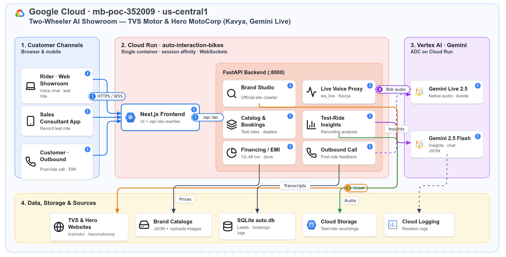

# Two-Wheeler AI Showroom — Kavya Omnichannel Platform (TVS Motor · Hero MotoCorp)

An omnichannel AI demo for **two-wheeler dealerships** (motorcycles & scooters). It covers the full customer journey:
**Pre-Sales voice discovery** with the Kavya AI avatar → **Sales Consultant mobile app** that records the test ride and extracts insights →
**post-ride outbound feedback call** → **two-wheeler financing (EMI) & document upload**.

The catalogs are **crawled from the official brand websites** (`tvsmotor.com`, `heromotocorp.com`) — real models, prices, specs and product images.

> This repo is a fork of the four-wheeler `auto-interaction` demo, kept as an independent codebase and deployed as a **separate Cloud Run service**.

---

## 🏗️ Architecture



| Zone | What runs there |
| :--- | :--- |
| **1. Customer Channels** | Rider web showroom (voice chat, test-ride booking), Sales Consultant mobile app (test-ride recording), customer post-ride call & EMI |
| **2. Cloud Run `auto-interaction-bikes`** | One container: Next.js frontend on `$PORT` rewrites `/api`, `/ws`, `/uploads` to FastAPI on `:8000`. Backend modules: Brand Studio crawler, Live Voice Proxy (Kavya), Catalog & Bookings, Test-Ride Insights, Financing/EMI, Outbound Call |
| **3. Vertex AI · Gemini** | **Gemini Live 2.5 native audio** (female voice `Aoede`, `en-IN`) over the Bidi WebSocket for live and outbound calls; **Gemini 2.5 Flash** for insights, REST chat fallback, crawler extraction and vision image pick |
| **4. Data, Storage & Sources** | Official TVS / Hero websites (crawl source), brand catalog JSON + `/uploads` images, SQLite `auto.db`, Cloud Storage (test-ride audio), Cloud Logging |

Numbered badges: **①** rider connects over HTTPS/WSS → **②** frontend proxies to the backend → **③** live audio streams to Gemini Live → **④** Brand Studio crawls the official brand sites.

The diagram is generated with **Dendrite**. Edit [`docs/architecture/bike_showroom_architecture.dendrite`](docs/architecture/bike_showroom_architecture.dendrite) in Dendrite Studio (go/dendrite), or open [`bike_showroom_architecture.drawio`](docs/architecture/bike_showroom_architecture.drawio) in draw.io.

---

## 🎬 End-to-End Demo Flow

### 1. Pre-Sales — Website voice journey
- The rider opens the showroom and starts a real-time **Gemini Live** voice chat with **Kavya** (female voice `Aoede`).
- Kavya qualifies the rider: daily commute, city vs highway, solo vs pillion, rider height and experience, petrol vs electric (home charging?), budget, and motorcycle vs scooter.
- She quotes real specs from the crawled catalog: cc / PS / Nm, mileage (kmpl) or EV range, ABS/CBS, seat height, kerb weight, riding modes and connectivity.
- She books a **test ride** through the in-chat calendar and reminds the rider about the **riding licence and helmet**.

### 2. Sales Mobile App — Test ride recording & insights
- The Sales Consultant loads the lead captured in step 1 and selects the bike.
- They record the test-ride conversation with the phone's recorder (or simulate one). Audio goes to GCS and Gemini extracts insights: pickup, braking/ABS confidence, handling, rider fit, pillion comfort, mileage/range, competitor mentions (Bajaj, Honda, Yamaha, Royal Enfield, Ather, Ola) and next steps.

### 3. Outbound Call — Post-ride feedback
- Kavya calls the rider after the test ride with the ride transcript as context. She asks about the experience and resolves open questions, staying within the brand guardrails.

### 4. Financing
- Two-wheeler loan EMI: tenure 12–48 months, down payment 10–25%, default rate 10.49%. Documents (Aadhaar, salary slip, …) can be uploaded.

---

## 🏍️ Brands & Real Catalog Crawling

| Brand | Brand id | Source | Models |
|---|---|---|---|
| TVS Motor (default active) | `tvs` | https://www.tvsmotor.com/ | 16 (Apache RTR/RR, Raider, Ronin, Radeon, Star City+, Sport, NTORQ, Jupiter, Zest, iQube, Orbiter, X) |
| Hero MotoCorp | `hero_motocorp` | https://www.heromotocorp.com/en-in.html | 15 (Splendor+, Super Splendor, HF Deluxe, Passion+, Glamour X, Xtreme, Xpulse, Karizma XMR, Destini, Pleasure+, Xoom) |

Catalogs live at `backend/data/brands/<brand_id>.json`. Images and logos are downloaded to `backend/static/uploads/<brand_id>/{vehicles,logos}/` and served at `/uploads/...`.

### Re-crawl
```bash
cd backend
PYTHONPATH=. ./.venv/bin/python scripts/crawl_bike_brands.py          # TVS + Hero (TVS set active)
PYTHONPATH=. ./.venv/bin/python scripts/crawl_bike_brands.py hero     # one brand
```
A full crawl takes about one minute per brand. Brand Studio in the UI uses the same pipeline (`BrandCrawlerService.crawl_and_extract_catalog`) for any brand URL.

### How the crawler works (`backend/app/services/brand_crawler_service.py`)
1. **Discovery:** starts from curated official model URLs per known brand and adds links matching a model URL pattern found on the seed pages.
2. **Page scrape** (httpx + BeautifulSoup):
   - Collects JSON-LD, og:image and ``/`<source>` images.
   - Collects **360° spin / colour-configurator frames** found in the page's JS/JSON (the cleanest studio shots).
   - Falls back to embedded JSON state for Sitecore JSS / Next.js pages.
3. **Extraction:** one Gemini call per model page returns a `VehicleItem`, including the two-wheeler fields.
4. **Gap fill:** mileage/range and missing specs (seat height, kerb weight, top speed, …) come from model knowledge and are **marked "(approx.)"**. Values scraped from the page are never overwritten.
5. **Hero image:** candidates are ranked, downloaded and scored by heuristics (transparent/white background, aspect ratio, blank-frame rejection). A **Gemini vision pick** then chooses the clean product photo in batches of 8; if none qualifies, a placeholder is used.
6. **Fallbacks:** a knowledge-only catalog for JS-only sites, default dealerships, and a generated vector logo.

Known limits:
- Hero's EV brand **Vida** (`vidaworld.com`) renders only in JavaScript, so it is not crawled.
- TVS loads prices client-side, so prices without a scraped value are knowledge-filled and marked "(approx.)".

Two-wheeler fields on `VehicleItem` (`backend/app/schemas/catalog.py`, all optional):
`source_url, displacement_cc, max_power, max_torque, kerb_weight, seat_height, fuel_tank_or_battery, top_speed, braking, riding_modes[], colors[], competitors[]`.

---

## 🗂️ Repository Layout

| Path | Description |
| :--- | :--- |
| `backend/app/routers/ws_live.py` | Gemini Live Bidi proxy (browser ⇄ Vertex AI), tool calling, transcript persistence, REST chat fallback |
| `backend/app/services/gemini_live_session.py` | Brand-agnostic Kavya prompt built from the active catalog, language detection |
| `backend/app/services/brand_crawler_service.py` | Official-website crawler (see above) |
| `backend/app/services/genai_client.py` | Shared `google-genai` client: ADC on Cloud Run, `gcloud` user token locally |
| `backend/app/services/financing_service.py` | Two-wheeler EMI calculator |
| `backend/scripts/crawl_bike_brands.py` | CLI to (re)crawl TVS / Hero |
| `backend/seeds/seed_dealerships.py` | Re-runnable seed: 6 demo dealerships each for `tvs` and `hero_motocorp` (`--purge` clears user data) |
| `frontend/` | Next.js App Router UI (React + Tailwind) |
| `Dockerfile` / `entrypoint.sh` | Single-container build (Next.js + FastAPI) for Cloud Run |

---

## 🗣️ Live Voice Session Behaviour

- **Default language `en-IN`.** The greeting is always in English. **Dynamic follow-up language mode:** Kavya mirrors the language of each customer turn (Hindi / Hinglish / regional languages), using feminine Hindi grammar.
- **Booking a test ride does not end the call.** `end_call` is suppressed on booking turns.
- **Automatic end on farewells** ("no thank you", "bye", Devanagari variants), or on an unambiguous closing line from Kavya.
- **Guardrails:** Kavya stays on the active brand and politely deflects questions about competitors or off-topic subjects.

### Local authentication for Gemini
All Gemini calls (Live, REST chat, crawler, sales insights, outbound) need `aiplatform.endpoints.predict` on the project.
- **Cloud Run** (`K_SERVICE` set): service-account ADC.
- **Local:** the token comes from `gcloud auth print-access-token` and is refreshed every 45 minutes, because workstation ADC is often a different identity. Check with `gcloud auth list`.

---

## ⚙️ Configuration & Environment Variables

| Variable | Description | Default |
| :--- | :--- | :--- |
| `PROJECT_ID` / `VERTEX_PROJECT_ID` | GCP project with Vertex AI | `mb-poc-352009` |
| `LOCATION` / `VERTEX_LOCATION` | Vertex AI region | `us-central1` |
| `GEMINI_LIVE_MODEL` | Live native-audio model | `gemini-live-2.5-flash-native-audio` |
| `REST_CHAT_MODEL` | Text/JSON/vision model (chat fallback, crawler, insights) | `gemini-2.5-flash` |
| `AVATAR_NAME` / `AVATAR_VOICE` | Persona / Vertex voice | `Kavya` / `Aoede` |
| `PROJECT_NAME` | Service title | `Two-Wheeler Intelligent Assistant with Kavya AI` |
| `DEFAULT_LOCALE` | Default locale | `en-IN` |
| `DEFAULT_DEALERSHIP` | Fallback dealership label | `Authorised Two-Wheeler Dealership, Mumbai` |
| `DATABASE_URL` | SQLite or PostgreSQL DSN | `sqlite+aiosqlite:///data/auto.db` |
| `GCS_RECORDINGS_BUCKET` / `GCS_BUCKET` | Test-ride recordings bucket | `mb-poc-352009-sales-recordings` |
| `ENABLE_SMS_DISPATCH` | SMS for bookings / follow-ups | `true` |
| `CRAWLER_MAX_MODELS` | Max models per brand crawl | `16` |
| `CRAWLER_FETCH_CONCURRENCY` / `CRAWLER_GEMINI_CONCURRENCY` | Crawl parallelism | `6` / `6` |
| `CRAWLER_PAGE_TIMEOUT_S` | Per-page fetch timeout | `15` |
| `PORT` | Frontend port in the container | `8080` |

Frontend (optional): `NEXT_PUBLIC_API_URL`, `NEXT_PUBLIC_WS_URL`. When unset, the frontend uses the current origin and the Next.js rewrites (`/api`, `/uploads`, `/ws` → `127.0.0.1:8000`).

---

## 💻 Local Development

```bash
# Backend
cd backend
python3 -m venv .venv && ./.venv/bin/pip install -r requirements.txt
PYTHONPATH=. ./.venv/bin/pytest tests -q                   # 34 tests
PYTHONPATH=. ./.venv/bin/python seeds/seed_dealerships.py  # demo dealerships (re-runnable)
PYTHONPATH=. ./.venv/bin/uvicorn app.main:app --host 0.0.0.0 --port 8000 --reload --reload-dir app

# Frontend (second terminal)
cd frontend
npm install
npx tsc --noEmit
npm run dev -- -p 3000 -H 0.0.0.0
```
Open http://localhost:3000. Both processes must be running. Always browse via the frontend origin.

---

## ☁️ Cloud Run Deployment

Deployed as its **own service** (`auto-interaction-bikes`) so the car demo (`auto-interaction`) is unaffected.

```bash
# make sure SQLite WAL files are merged / absent before building
sqlite3 backend/data/auto.db "PRAGMA wal_checkpoint(TRUNCATE);" && rm -f backend/data/auto.db-wal backend/data/auto.db-shm

gcloud run deploy auto-interaction-bikes \
  --source . \
  --project=mb-poc-352009 \
  --region=us-central1 \
  --platform=managed \
  --allow-unauthenticated \
  --set-env-vars="ENABLE_SMS_DISPATCH=true,PROJECT_ID=mb-poc-352009,LOCATION=us-central1,VERTEX_PROJECT_ID=mb-poc-352009,VERTEX_LOCATION=us-central1" \
  --memory=2Gi --cpu=2 --timeout=3600 --session-affinity
```
- `--session-affinity` and the long timeout keep the live-audio WebSocket on one instance.
- `backend/static/uploads/{tvs,hero_motocorp}` and `backend/data/brands/*.json` ship in the image; the catalog references those images.
- The runtime service account needs `aiplatform.endpoints.predict`.

---

## 🗃️ Data & Customer Identity

- **No synthetic users.** The DB ships with only reference data (dealerships, slots, holidays). Customers are created only when a real rider shares a name and phone number.
- A unique customer is **name + phone**. Conversations are grouped **per day** in the Sales Consultant view: bike of interest, features discussed, budget.
- SQLite is ephemeral on Cloud Run. Set `DATABASE_URL` to PostgreSQL for persistence.
